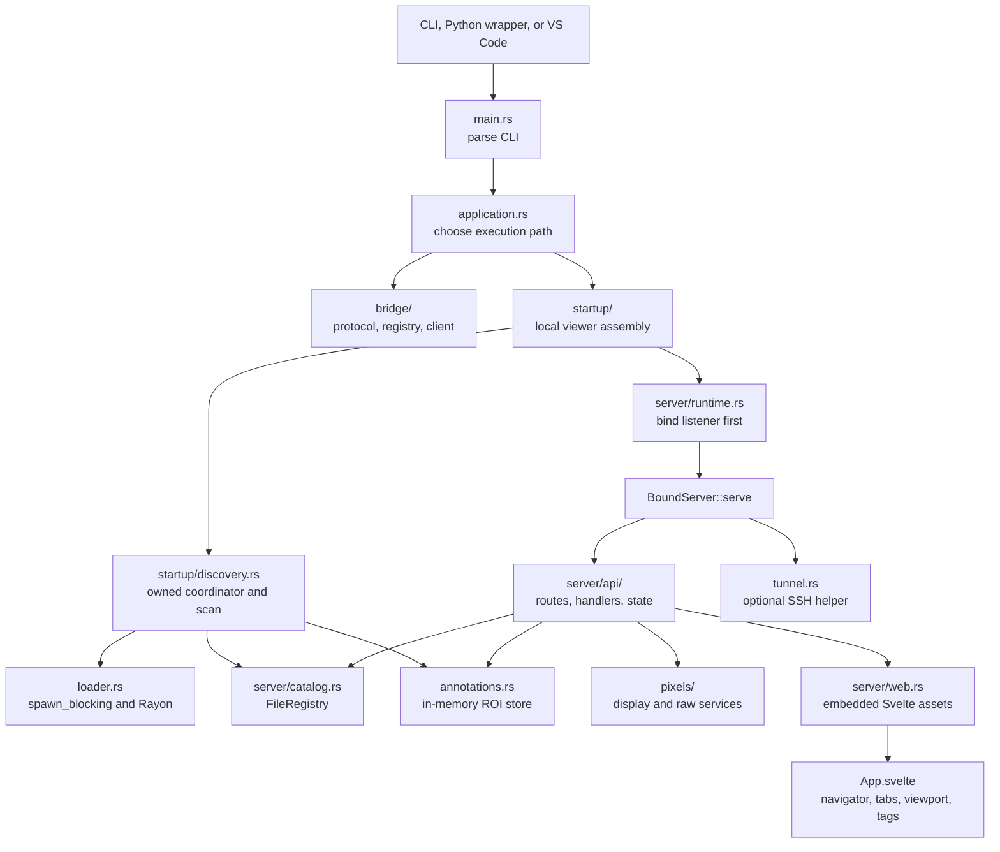
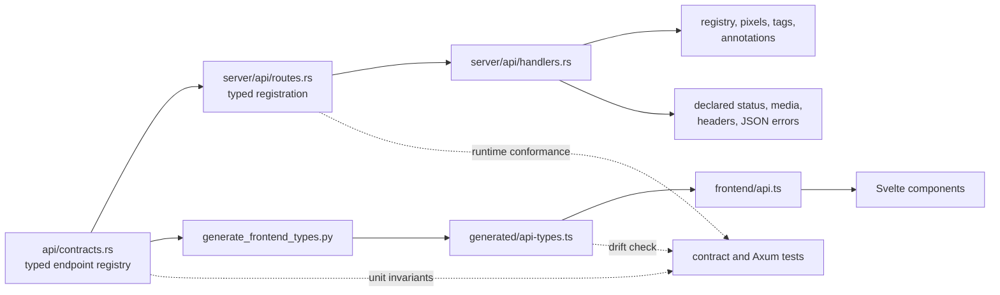
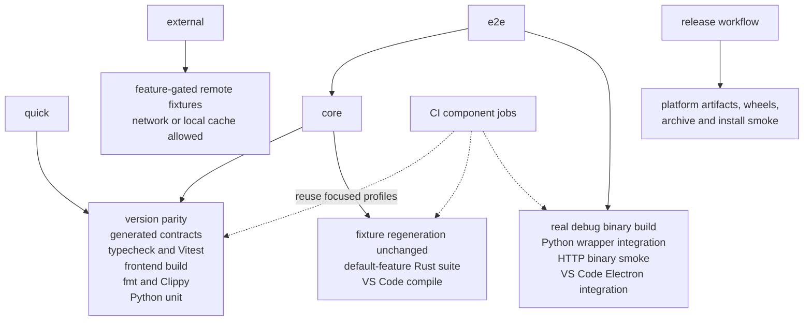
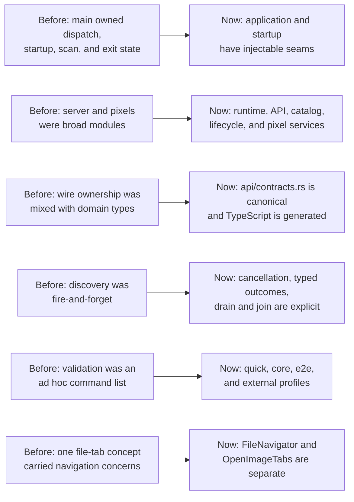

# dcmview Architecture

This document is the normative current-state architecture and testing model for
the repository. Update it when module ownership, dependency direction, HTTP
contracts, lifecycle ownership, or the canonical check profiles change.

`dcmview` is an ephemeral research and development viewer. The Rust binary is
the product center; the Svelte frontend is embedded into that binary, and the
Python and VS Code integrations launch or route to the same executable.

## Assessment

The codebase is organized around explicit seams rather than one application
module:

| Boundary | Owner | Stable contract or seam |
|---|---|---|
| Process dispatch | `src/application.rs` | `ApplicationServices` selects hidden bridge, workspace bridge, or local viewer without starting unrelated subsystems. |
| Local startup | `src/startup/` | `LocalViewerOptions`, `LocalViewerOutcome`, `DiscoveryHandle`, and `DiscoverySpawner`. |
| HTTP wire model | `src/api/contracts.rs` | Typed endpoint registry, wire structs, query names, response header names, and error envelope. |
| HTTP runtime | `src/server/` | Listener/runtime, route registration, handlers, state, registry, activity tracking, tags, and embedded assets. |
| Pixel service | `src/pixels/` | Typed display/raw requests, cache behavior, transfer-syntax classification, decoding, rendering, and `PixelError`. |
| DICOM discovery | `src/loader.rs` | Progressive events, cancellation, reports, metadata filters, and `FileEntry` construction. |
| Frontend client | `frontend/src/api.ts` | Typed fetch wrappers over generated endpoint metadata and wire types. |
| Cross-language generation | `scripts/generate_frontend_types.py` | Checked-in `frontend/src/generated/api-types.ts` derived from the Rust HTTP contract. |

The current separation is suitable for informative automated tests. Unit tests
can replace process dispatch and discovery production services, Axum integration
tests can execute a router without a process, and end-to-end profiles still
exercise a real binary where process behavior matters.

## Runtime And Module Flow

### Ownership And Dependency Direction

The binary-private orchestration modules depend on the reusable library
modules, not the reverse:

1. `main.rs` owns the Clap shape and process exit only.
2. `application.rs` owns dispatch order and tracing initialization. It tries the
   hidden bridge mode, then workspace bridge routing, then local startup.
3. `startup/mod.rs` validates local options and annotations, constructs
   `FileRegistry`, `AnnotationStore`, `AppState`, and `ServerConfig`, binds the
   listener, starts discovery, serves, and joins discovery before returning.
4. `startup/discovery.rs` translates loader events into registry and annotation
   updates. It does not own HTTP routing.
5. `server/runtime.rs` owns listener, browser, tunnel, and graceful-shutdown
   resources. `server/api/` owns HTTP concerns. `server/catalog.rs` owns the
   progressive file registry.
6. `pixels/service.rs` is the server-facing pixel boundary. Codec, cache,
   rendering, and window modules remain below it.

`src/api/contracts.rs` owns browser-visible wire declarations. `src/types.rs`
owns internal DICOM, cache-key, transfer-syntax, and windowing domain types; it
re-exports selected wire types for compatibility but is not their source of
truth.

The frontend root is `App.svelte`. It composes `FileNavigator`,
`OpenImageTabs`, `ViewerToolbar`, `ImageViewport`, `FrameSlider`, `TagPanel`,
and `StatusBar`. Components use `frontend/src/api.ts`; new endpoint fetches
should not be introduced directly inside components.

## Executable HTTP Contract

The endpoint registry declares the operation, method, path, query type, request
type and media type, response type and media type, response-header kind, error
type, and success status for every `/api` operation. Route registration matches
each operation to a handler with compile-time request and response constraints.

The executable contract is kept consistent by three layers:

- Rust contract tests check registry uniqueness, type relationships, query
  names, and header names.
- Axum integration tests execute every declared endpoint and compare its
  status, media type, and required response headers. Boundary rejections are
  also checked for the shared JSON error envelope.
- Frontend generation tests and `check:contracts` reject drift in generated
  endpoint metadata and TypeScript wire types.

### Endpoint Invariants

- Every API error is a JSON `ErrorResponse` shaped as `{"error":"..."}`.
  Path, query, and JSON extractor failures pass through the same envelope.
- Unknown `/api` routes return JSON `404`; unsupported methods return JSON
  `405`.
- Supported display frames return `image/png`; supported raw frames return
  `application/octet-stream`; annotation export returns
  `text/csv; charset=utf-8`.
- Every successful display or raw frame response includes `X-Cache: HIT` or
  `X-Cache: MISS`.
- Raw responses include all required `X-Frame-*` metadata headers. Default
  window headers are present only when the DICOM supplies a default window.
- Unsupported transfer syntaxes and raw layouts are `422`; missing pixels and
  out-of-range frames are `404`; decode failures are request-scoped `500`
  responses and do not stop the server.

Display cache keys include file, frame, normalized window parameters, and
window mode. Full-dynamic mode ignores explicit window values. Raw cache keys
include file and frame only. Cache locks are held for lookup or insertion, never
while reading DICOM, decoding, rendering, or encoding.

See [the HTTP API reference](api.md) for endpoint payloads and headers.

## Lifecycle And Discovery Ownership

Local startup follows a strict order:

1. Validate tunnel options and load the optional annotation CSV.
2. Construct state and configuration.
3. Bind `BoundServer`; an occupied explicit port fails before discovery starts.
4. Spawn the owned discovery scan and coordinator.
5. Serve until OS signal, external failure notification, or idle timeout.
6. Request discovery cancellation and await both Tokio tasks and the loader's
   `spawn_blocking`/Rayon work before returning.

The loader sends events through a bounded channel. The coordinator drains that
channel, validates matching annotations, updates `FileRegistry`, records
skipped and filtered counts, and marks the scan complete. Annotation, scan, and
no-files failures produce typed failure outcomes and a durable external
shutdown notification. Normal server exit during an incomplete scan is a
requested cancellation and remains a successful process outcome.

`RequestActivity` tracks in-flight requests and a monotonic idle baseline.
Idle timeout does not start while the registry is both empty and incomplete,
and graceful shutdown lets in-flight requests drain. Browser and tunnel tasks
are owned by `BoundServer::serve` and cleaned up on every normal return or
error.

`DiscoveryHandle::Drop` requests cancellation as a backstop. The supported
lifecycle is the explicit `cancel_and_wait` path; callers that later embed
startup in an abortable Tokio task must add a supervisor contract if they need
join guarantees after hard task abortion.

## Test Layers And Check Profiles

`scripts/check.py` is the canonical check entry point:

The supported development baselines are Rust 1.88+, Node.js 20.19+, and Python
3.9+. CI pins Rust 1.88 and the current Node 20 line.

| Profile | Intended use | Exact coverage |
|---|---|---|
| `quick` | Normal development loop | Version parity; generated frontend contract check; Svelte/TypeScript checks; Vitest; frontend build; Rust format and strict all-target Clippy; Python unit and packaging-helper tests. It does not run Rust tests or VS Code tests. |
| `core` | Before handing off a normal code change | Everything in the corresponding frontend/lint/unit layers, plus deterministic fixture regeneration that must leave the current fixture tree unchanged, the default-feature, non-ignored locked Rust suite, and VS Code compilation. |
| `e2e` | Process or integration changes | `core`, then a real debug binary, Python wrapper binary integration, debug-binary HTTP smoke, and VS Code Electron integration. |
| `external` | Opt-in upstream DICOM compatibility | Builds frontend assets and runs only ignored integration tests behind `remote-fixtures`; those tests may download or populate the `dicom-test-files` cache. It is separate from `e2e`. |

Pass `--install` when the profile should run `npm ci` for the frontend and, when
needed, VS Code dependencies. Without it, installed dependencies are reused.
CI invokes focused profiles in separate jobs so failures identify the affected
layer; the aggregate profiles remain the local source of truth. Dependency
installation and VS Code Electron integration can also use network/cache state;
`external` specifically denotes upstream DICOM fixture coverage.

### Test Seams

- `ApplicationServices` records dispatch calls without launching bridge or
  server processes.
- `DiscoverySpawner` drives completion, cancellation, annotation failure,
  scan failure, and no-files cases without filesystem timing.
- `BoundServer::bind` is separate from `serve`, so bind ordering and occupied
  ports are deterministic.
- `server::router(AppState)` supports in-process `axum-test` coverage for the
  complete HTTP boundary.
- Generated DICOM fixtures exercise real discovery and codec paths. Integration
  tests do not mock the DICOM layer.
- Frontend state helpers, cache policy, windowing, registry shaping, and API
  wrappers are tested as TypeScript modules.
- Python unit tests isolate subprocess policy; `python-integration` adds the real
  binary. VS Code compile and Electron integration remain separate layers.
- `python/tests/test_check_profiles.py` locks the documented
  `quick`/`core`/`e2e` composition and the exact independent `external` command
  without launching toolchains.

### Intentionally External Coverage

- Two upstream `dicom-test-files` cases are ignored in normal Rust runs and live
  in the `external` profile because they can use network and cache state: one
  loader/API metadata case and one JPEG 2000 display/cache case. Committed JPEG
  2000 fixtures remain in normal coverage. No CI or release job invokes
  `external`.
- Release workflows, not `core`, prove platform archives, bundled wheels,
  installed console scripts, VSIX packaging, and release-binary smoke behavior.
- A real SSH server and institution-specific DICOM corpora are not committed
  test dependencies. Tunnel failure behavior uses controlled integration tests;
  broader compatibility is manual or reported with de-identified data.
- Performance targets require explicit timing and memory instrumentation. They
  are not inferred from mocked or ordinary correctness tests.

## Remediation Map

### Non-Blocking Extension Points

The approved structural remediations are complete. These are non-blocking
extension points, not current correctness blockers:

1. If local startup is ever exposed as an abortable library API, introduce an
   explicit supervisor/reaper contract for hard task abortion; the binary's
   current result-based lifecycle already joins its work.
2. Add opt-in performance benchmarks before enforcing startup, first-frame, or
   cache-memory thresholds in CI.
3. Keep external upstream fixtures opt-in unless their availability and cache
   behavior become deterministic enough for normal CI.
4. When adding an endpoint, change the Rust contract first, regenerate checked-in
   TypeScript, register the typed handler, and extend runtime contract tests.

## Maintainer Invariants

- Bind loopback by default; preserve warnings for non-loopback binds.
- Keep the server ephemeral: no database, persistent configuration, or DICOM
  mutation.
- Keep bridge and local startup mutually exclusive at the dispatch boundary.
- Bind before starting discovery, and join discovery on every supported server
  exit or error path.
- Keep CPU, codec, filesystem, and Rayon work off the async executor.
- Do not hold cache or registry locks across I/O, decode, encode, or await.
- Treat `src/api/contracts.rs` plus its generated TypeScript as one contract.
- Add endpoint fetches through `frontend/src/api.ts`.
- Use generated synthetic fixtures for integration coverage; never commit PHI.
- Run the narrow profile while iterating, then the profile required by the
  highest boundary changed.
